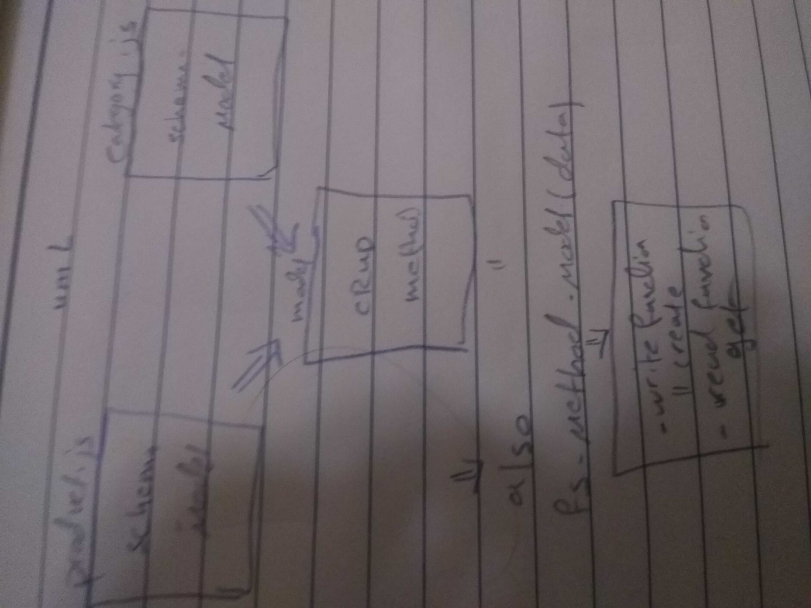

# Data-ModelingLAB -
 Class 04
## Data Modeling
Author: Mai Yousef
## Links and Resources
submission PR
https://github.com/401-advanced-javascript-Mai/Data-Modeling/pulls

ci/cd (GitHub Actions)
https://github.com/401-advanced-javascript-Mai/Data-Modeling/actions

## Setup
## How to initialize/run your application (where applicable)
e.g. npm start
## Tests
## How do you run tests? 'npm test'
## Describe any tests that you did not complete, skipped, etc all complete .
UML
Link to an image of the UML for your application and response to events

